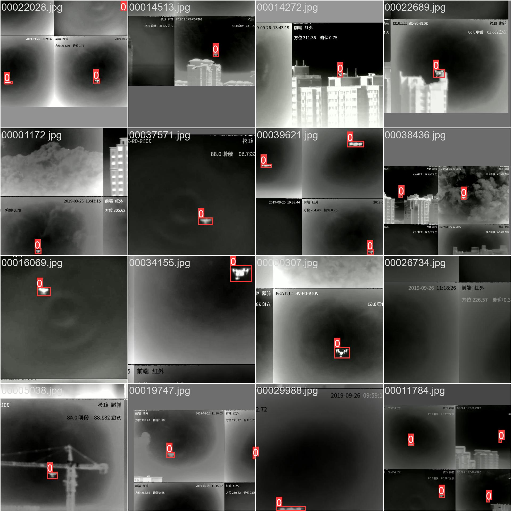
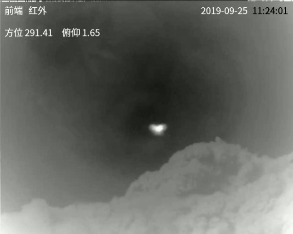
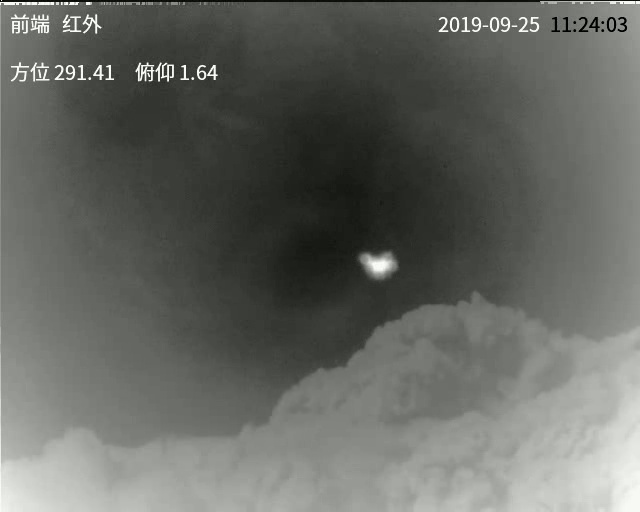
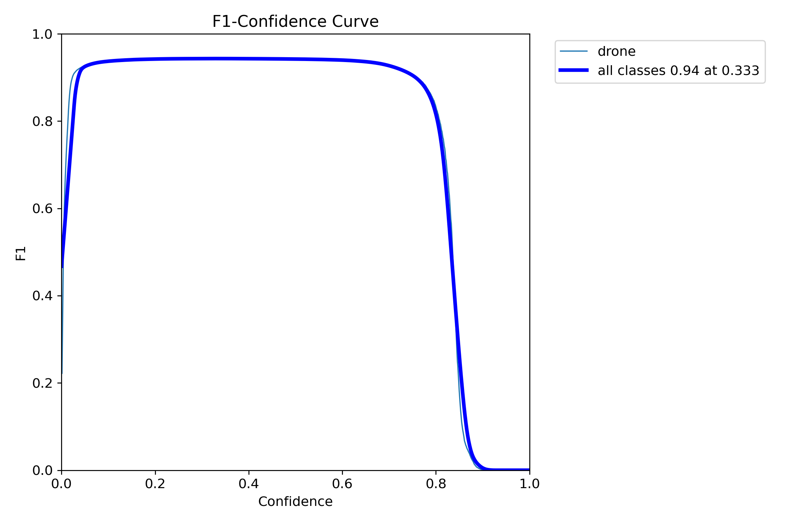
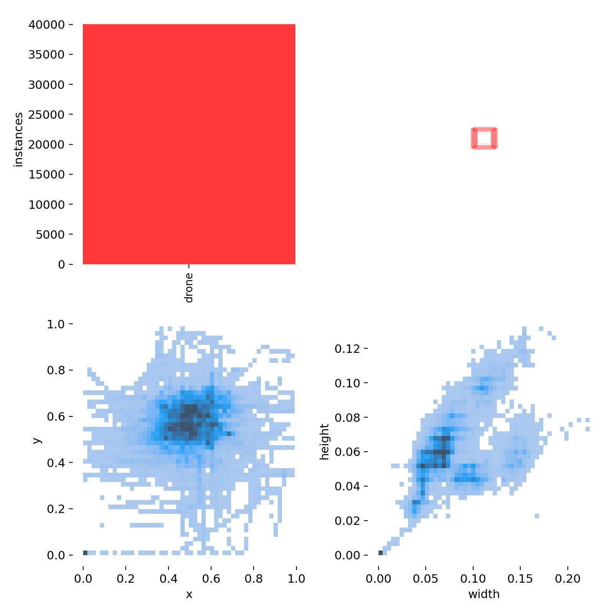

# __OSTrack__



OSTrack is an artificial intelligence technology for tracking and locking unmanned aerial vehicles based on the ViT deep network model. OSTrack is based on the Vision of Transformer deep learning model. For unmanned aerial vehicles moving at high speed in the near and far fields, it uses visual tracking to lock the position of the unmanned aerial vehicle in real-time video frames. The model mainly uses multiple initial anchor bounding boxes, obtains feature maps through feature extraction based on network input, and the position of the unmanned aerial vehicle is determined by the votes of the anchor boxes given by the network model. The trained network model has certain robustness to near and far fields, partial occlusion, and light changes.  


## 1.Environment

| Name | Version |   Name | Version |
|------|---------|--------|---------|
| Python | 3.8.10 |   PyTorch | 2.4.1 |
| opencv-python | 4.9.0.80 |   Tkinter | 8.6 |
| pillow | 10.2.0 | torchvision | 0.19.1 |

## 2.Usage

Now you can use utils.py to get the ostrack model and use it for training and testing.the model architecture is shown below:  CEblock has 12 layers, and there is also a detection head with five layers behind it. However, in reality, the test input data of Ostrack requires template and search images. Only through manual annotation or automatic annotation can the specific location of the small - scale drone in the first - frame image of the video sequence, that is, the template image, be determined. While the search image doesn't need to be processed, and a normal sequence frame can be selected.

| CEBlock | Detection Head |
| ------ | ------------- |
|  |  |

## 3.TODO

- [x] Finish the model configuration code and import the vit_base_384_model_ce model.
- [x] Train an initial - frame localization model using YOLOv5 for the automatic annotation of templates.
- [ ] Complete the function of drone tracking for imported videos in OSTrack.
- [ ] Finish the GUI interface for OSTrack and YOLOv5 models' deployment.  

| search | template |
| ------ | ------------- |
|  |  |
|  |  |

## 4.Results

Now this is YOLOv5 model's  training results, consisting of confusion_matrix, labels_correlogram, F1_curve, labels and PR/P/R_curve. The training results of YOLOv5 are not included in this project.  Next, you'll deploy the s/m/l/x models of YOLOv5. When you encounter the following error in a Windows 10/11 system environment: raise NotImplementedError("cannot instantiate %r on your system"), you can add the following code to the first line of the ./yolov5/utils/general.py file.

```bash
# the error is as follows:
raise NotImplementedError("cannot instantiate %r on your system")
NotImplementedError: cannot instantiate 'PosixPath' on your system

# you can add the following code to the first line of the ./yolov5/utils/general.py file.
import pathlib
temp = pathlib.PosixPath
pathlib.PosixPath = pathlib.WindowsPath
```

如果您想压缩无人机红外视频,您可以选择下面的命令来压缩视频为.gif格式.

```bash
ffmpeg -ss 00:00:05 -t 00:00:05 -i video/infrared.mp4 -vf "fps=1,scale=640:\
-1:flags=lanczos,split[s0][s1];[s0]palettegen=stats_mode=single:max_colors=16[p];\
[s1][p]paletteuse=dither=floyd_steinberg" -gifflags +transdiff -loop 0 \
-final_delay 20 -y output_3mb.gif
```

| confusion_matrix | labels_correlogram |
| ------ | ------------- |
|  |  |

| F1_curve | labels |
| ------ | ------------- |
|  |  |

| PR_curve | P_curve | R_curve |
| ------ | ------------- | ------------- |
|  |  |  |

Before training, the dataset architecture is shown below:


## 5.Thanks

```bash
# If you are interested in the original project, you can click on the link below.
https://github.com/LY-1/MCJT
```

Meanwhile, it is declared that this project is the reproduction and improvement based on the work of [original author](https://github.com/LY-1/MCJT). We used a new self-made dataset for training and designed the GUI interface for deployment based on the trained model. Subsequently, we will also conduct actual operations to test the actual effect of the model. We are very grateful to the original author for his work. Of course, if you think our work based on this can attract you, please also give a little star.
