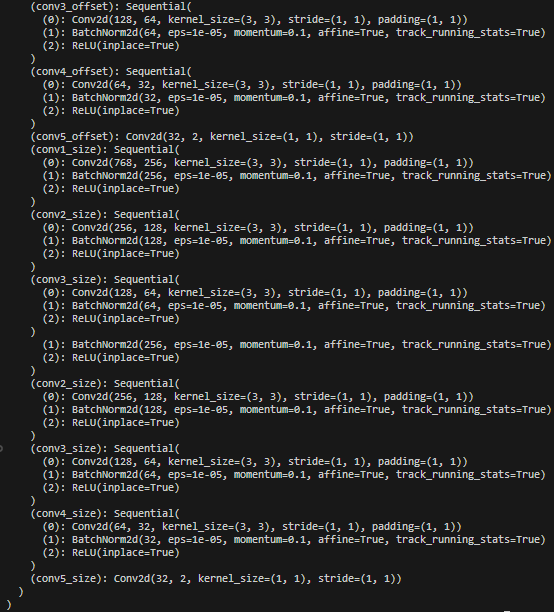

# __OSTrack__

OSTrack is an artificial intelligence technology for tracking and locking unmanned aerial vehicles based on the ViT deep network model. OSTrack is based on the Vision of Transformer deep learning model. For unmanned aerial vehicles moving at high speed in the near and far fields, it uses visual tracking to lock the position of the unmanned aerial vehicle in real-time video frames. The model mainly uses multiple initial anchor bounding boxes, obtains feature maps through feature extraction based on network input, and the position of the unmanned aerial vehicle is determined by the votes of the anchor boxes given by the network model. The trained network model has certain robustness to near and far fields, partial occlusion, and light changes.


## 1.Runtime Environment

| Name | Version |   Name | Version |
|------|---------|--------|---------|
| Python | 3.8.10 |   PyTorch | 2.4.1 |
| opencv-python | 4.9.0.80 |   Tkinter | 8.6 |
| pillow | 10.2.0 | torchvision | 0.19.1 |

## 2.Usage

Now you can use utils.py to get the ostrack model and use it for training and testing.
the model architecture is shown below:



        
        
## 3.Thanks

```bash
# If you are interested in the original project, you can click on the link below.
https://github.com/LY-1/MCJT
```

Meanwhile, it is declared that this project is the reproduction and improvement based on the work of [original author](https://github.com/LY-1/MCJT). We used a new self-made dataset for training and designed the GUI interface for deployment based on the trained model. Subsequently, we will also conduct actual operations to test the actual effect of the model. We are very grateful to the original author for his work. Of course, if you think our work based on this can attract you, please also give a little star.
